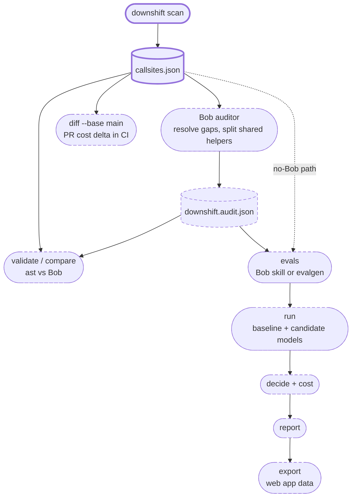

# Architecture

## Overview

Downshift is a Python CLI that statically scans a repository for LLM call sites, resolves every model name and prompt template it can through AST analysis, and writes a structured `callsites.json`. Downstream commands use that file to generate evals per call site, test cheaper models against a baseline, recommend safe downgrades, and project the monthly cost impact of every PR in CI. A Bob custom mode (the Downshift Auditor) closes the gaps static analysis cannot.

## Module map

| Module | Purpose | Key public types / functions |
|---|---|---|
| [`cli.py`](../src/downshift/cli.py) | Typer entry point. `scan` is implemented; `evalgen`, `run`, `report`, `diff` and `dashboard` (to be renamed `export`) are stubs | `app`, `scan()` |
| [`scanner.py`](../src/downshift/scanner.py) | Walks the tree, parses each `.py` file, finds LLM calls with an AST visitor, resolves them with `Resolver`, builds a `ScanResult` | `scan_path()`, `scan_source()`, `scan_module()`, `iter_python_files()` |
| [`resolve.py`](../src/downshift/resolve.py) | Follows constants, imports, `os.getenv` defaults, dict lookups, `**kwargs` dicts, locals and parameter defaults across modules to resolve model names and prompt templates. Anything only known at runtime is left unresolved with a note | `Module`, `ModuleIndex`, `Resolver`, `Ctx`, `keyword_arg()` |
| [`schema.py`](../src/downshift/schema.py) | The shared data contract. The scanner and Bob both write through it, and every field is validated on load | `CallSite`, `ModelRef`, `PromptMessage`, `ScanResult`, `SchemaError` |
| [`config.py`](../src/downshift/config.py) | Loads `downshift.yaml`: provider endpoint, baseline and candidate models, per-model pricing, daily call volumes, scan include/exclude | `Config`, `ScanConfig`, `ModelsConfig`, `ModelPrice`, `VolumeConfig`, `resolve_config()`, `parse_config()` |
| [`llm.py`](../src/downshift/llm.py) | Thin client layer. `OpenAICompatClient` talks to any OpenAI-compatible endpoint (Ollama, vLLM, OpenAI). `FakeLLMClient` keeps tests offline | `LLMClient` (Protocol), `OpenAICompatClient`, `FakeLLMClient`, `Completion` |

Planned modules: `audit.py`, `evals.py`, `evalgen.py`, `runner.py`, `scorer.py`, `decide.py`, `cost.py`, `report.py`, `diff.py`, `export.py`.

## Pipeline

Solid boxes are implemented. Dashed boxes are planned.

## Where Bob fits

The scanner resolves what static analysis can. When it cannot, it records why: `model.source` becomes `kwargs`, `env` or `dynamic`, `model.value` is null, a prompt assembled at runtime is marked unresolved, and `notes` explains each gap in plain words.

Bob, running the Downshift Auditor mode, starts from the scan output and inspects only what the scanner flagged:

- **Unresolved models and prompts.** Bob reads the surrounding code and callers to fill in the real model and prompt.
- **Shared helpers.** A helper such as `ask()` may serve several features with different prompts. Bob splits it into one logical call site per feature and sets `via` to the helper's id.
- **Eval metadata.** For every call site Bob fills `purpose`, `output_contract`, `difficulty` and `grading`.

Bob writes its result to a separate `downshift.audit.json` with `found_by: "bob"`, never overwriting the scanner's file. `downshift validate` checks it against the same schema, and `downshift compare` shows the two side by side. On the SupportDesk example: ast finds 7 call sites with 6 models resolved, Bob produces 8 logical features with 8 models resolved.

Downshift works without Bob. The scanner, the `evalgen` fallback, the runner, the report and the CI diff all run standalone.

## Data contract

### `CallSite`

| Field | Type | Description |
|---|---|---|
| `id` | `str` | `<rel_path>::<qualname>`, e.g. `app/triage.py::classify`. Duplicates get `#2`, `#3` |
| `file` | `str` | Relative POSIX path |
| `line` | `int` | Line of the LLM call (>= 1) |
| `end_line` | `int \| null` | Last line of the call expression |
| `function` | `str` | Qualified name, e.g. `MyClass.method`; `<module>` for top level |
| `api` | `str` | Matched API, e.g. `openai.chat.completions`, `anthropic.messages` |
| `model` | `ModelRef` | How the model was resolved (below) |
| `is_async` | `bool` | Call is awaited inside an `async def` |
| `messages` | `PromptMessage[] \| null` | Prompt template when recoverable |
| `output_format` | `str` | `text` or `json` |
| `temperature` | `float \| null` | Literal temperature at the call |
| `max_tokens` | `int \| null` | Literal token limit at the call |
| `via` | `str \| null` | Id of the shared helper this logical call site routes through (set by Bob) |
| `callers` | `str[]` | Ids of functions that call this one (name-based) |
| `notes` | `str[]` | Plain-language explanation of every gap |
| `purpose` | `str \| null` | What the call is for (Bob or human) |
| `output_contract` | `str \| null` | Expected output shape or rules (Bob or human) |
| `difficulty` | `str \| null` | Task difficulty estimate |
| `grading` | `str \| null` | How evals for this call site are graded |
| `found_by` | `str` | Producer of this entry, default `ast` |

### `ModelRef`

| Field | Type | Description |
|---|---|---|
| `value` | `str \| null` | Resolved model name, or null |
| `source` | `str` | How it was obtained (below) |
| `expression` | `str` | Source text of the model argument |
| `env_var` | `str \| null` | Env var name for `env` / `env_default` |
| `defined_in` | `str \| null` | File where the model string lives |

### `PromptMessage`

| Field | Type | Description |
|---|---|---|
| `role` | `str` | `system`, `user`, `assistant` |
| `content` | `str` | Template text with `{placeholders}` |
| `resolved` | `bool` | False when built at runtime |

### Allowed values

**`found_by`, `generated_by`:** `ast`, `bob`, `manual`

**`model.source`:**

| Value | Meaning |
|---|---|
| `literal` | `model="gpt-4o"` at the call |
| `constant` | Named constant, possibly imported |
| `env_default` | `os.getenv("X", "model")`, default used |
| `env` | `os.getenv("X")` with no default, unknown until runtime |
| `dict_lookup` | `MODELS["key"]` on a dict literal |
| `parameter_default` | `def f(model="gpt-4o")` |
| `kwargs` | Passed through `**params` and not resolvable |
| `missing` | No `model=` argument |
| `dynamic` | Computed at runtime |
| `manual` | Set by a human or Bob |

**`difficulty`:** `easy`, `medium`, `hard`

**`grading`:** `exact` (normalized string match), `json_fields` (valid JSON, fields match), `judge` (baseline model scores 1 to 5)

**`output_format`:** `text`, `json`
